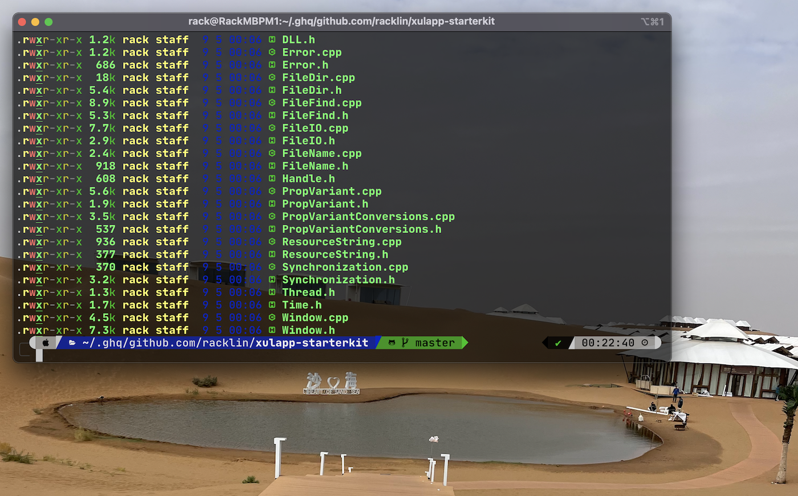

# Rack Lin's applications for devenv

**Warning**: Don’t blindly use my settings unless you know what that entails. Use at your own risk!

## Prerequisites
Make sure you have installed all of the following prerequisites on your development machine:

### OSX
- [Homebrew](https://brew.sh/)
  ```
  /bin/bash -c "$(curl -fsSL https://raw.githubusercontent.com/Homebrew/install/HEAD/install.sh)"
  ```
  Install mas
  ```
  brew tap Homebrew/bundle
  brew install mas
  ```
  Install xcode:
  ```
  xcode-select --install
  ```
### Windows
- [Scoop](https://scoop.sh/)
  ```
  > Set-ExecutionPolicy RemoteSigned -Scope CurrentUser # Optional: Needed to run a remote script the first time
> Invoke-WebRequest get.scoop.sh | Invoke-Expression
  ```
- [Chocolatey](https://chocolatey.org/)
  ```
  Set-ExecutionPolicy Bypass -Scope Process -Force; [System.Net.ServicePointManager]::SecurityProtocol = [System.Net.ServicePointManager]::SecurityProtocol -bor 3072; iex ((New-Object System.Net.WebClient).DownloadString('https://community.chocolatey.org/install.ps1'))
  ```


## How to use

### OSX
Install base apps:
```
brew bundle install --file=Brewfile-base
```
Install devtools:
```
brew bundle install --file=Brewfile-devtools
```


## About me

- [Twitter](https://twitter.com/racklin)
- [github](https://github.com/racklin)
